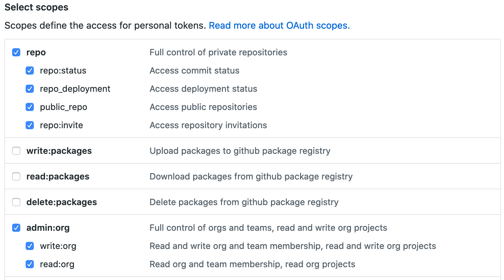
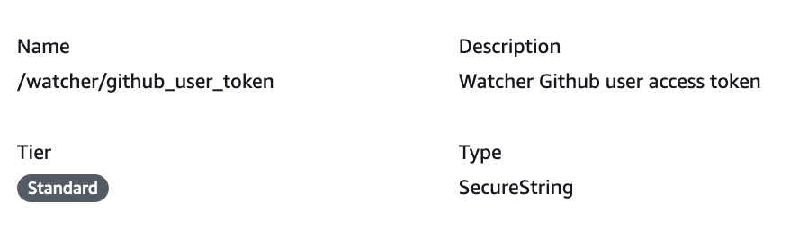
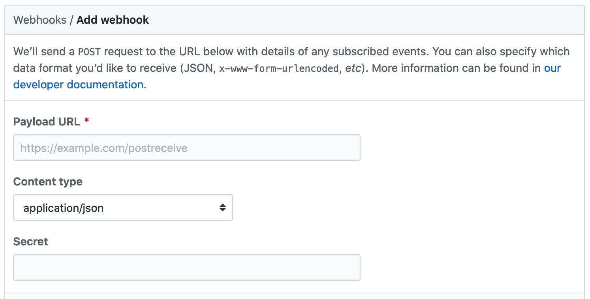
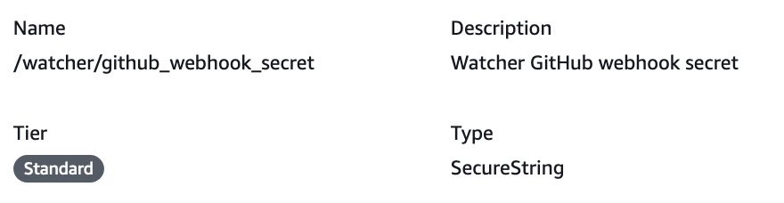
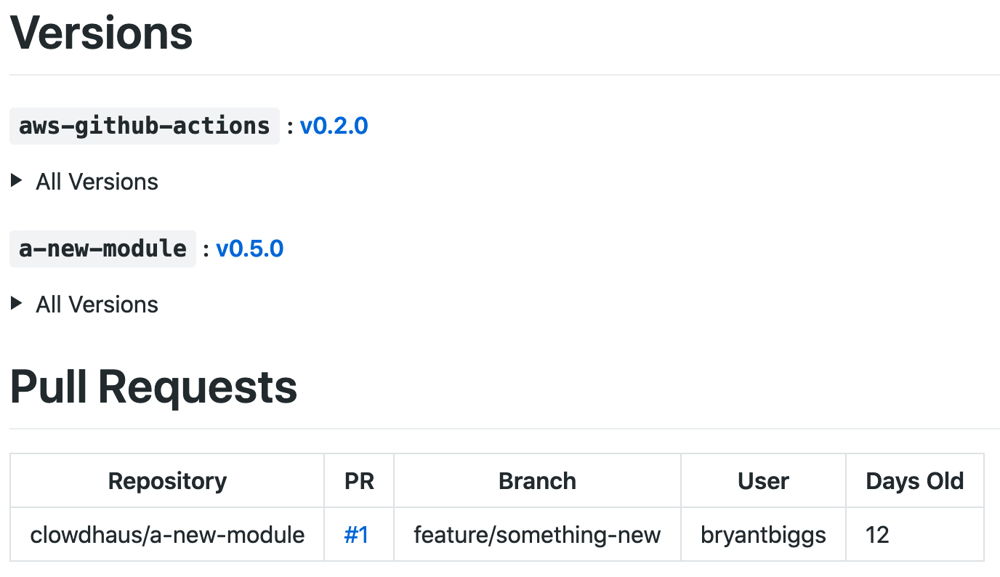

<p align="center">
  
</p>
<h1 style="font-size: 56px; margin: 0; padding: 0;" align="center">
  watcher
</h1>
<p align="center">
  
  
  
  <a href="http://commitizen.github.io/cz-cli/">
    
  </a>
</p>
<p align="center">
  <a href="https://github.com/clowdhaus/watcher/actions?query=workflow%3Atest">
    
  </a>
  <a href="https://github.com/clowdhaus/watcher/actions?query=workflow%3Adeploy">
    
  </a>
  <a href="https://snyk.io/test/github/clowdhaus/watcher">
    
  </a>
  <a href="https://lgtm.com/projects/g/clowdhaus/watcher/alerts/"></a>
</p>

## Table of Contents

| Directory               | Info                                                                             |
| :---------------------- | :------------------------------------------------------------------------------- |
| [`lambda/`](../lambdas) | Lambda function(s) source code and associated tests                              |
| [`layers/`](../layers)  | Package directories containing Dockerfiles for generating lambda layer artifacts |

## Functionality

| Description                                                    | Implemented |
| :------------------------------------------------------------- | :---------: |
| Maintains list of open pull requests                           |     ✅      |
| Re-sync list of open pull requests on schedule                 |     ✅      |
| Maintains list of latest releases                              |     ✅      |
| Re-sync list of latest releases on schedule                    |     ✅      |
| Creates release automatically when new tag created             |     ✅      |
| Create metadata repo if one is not provided nor does not exist |             |
| Modifies new repository settings upon creation                 |     ✅      |
| Re-sync repository settings on schedule                        |     ✅      |

## Conventions

This repository uses the following tools and conventions:

- [serverless](https://serverless.com/) for managing AWS Lambda functions
- [pipenv](https://github.com/pypa/pipenv) for managing Python dependencies and development environment
- Python 3.8
  - [flake8](https://github.com/PyCQA/flake8) & [radon](https://github.com/rubik/radon) for linting and static code analysis
  - [isort](https://github.com/timothycrosley/isort) for import statement formatting
  - [black](https://github.com/ambv/black) for code formatting

## Getting Started

The following instructions will help you get setup for local development and testing purposes.

### Prerequisites

#### [NPM](https://github.com/npm/cli) -or- [Yarn](https://github.com/yarnpkg/yarn)

The `serverless` framework is a Nodejs application used for resource deployment and requires `node` (>=12.x). See [here](https://serverless.com/framework/docs/providers/aws/guide/quick-start/) for more details about the framework.

The recommended way to install the framework is globally via `npm` or `yarn`:

```bash
  $ npm install serverless --global
  - or -
  $ yarn global add
```

However, if you run into issues where you have multiple projects that encounter version conflicts, you can use the locally installed version which is located at `./node_modules/serverless/bin/serverless`

Install the projects deployment dependencies locally by running the following command.

```bash
  $ npm i
  - or -
  $ yarn
```

#### [Pipenv](https://github.com/pypa/pipenv)

Pipenv is used to manage the python dependencies and required for local development. To install `pipenv` please refer to the project [installation documentation](https://github.com/pypa/pipenv#installation).

Install the projects Python dependencies (with development dependencies) locally by running the following command.

```bash
  $ make setup
```

To start with a "clean"/new workspace, execute the `clean` command followed by `setup`:

```bash
  $ make clean
  $ make setup
```

## Deployment

To deploy `watcher` into your own AWS account for your :octocat: GitHub organization:

1. Pull down a local copy of the project (git clone/fork, download zipped Github source files, etc.)

2. Create/specify a repository where `watcher` will report the collected data. You will need to insert the appropriate target tags in the repository's README.md file. `watcher` will inject the collected information between the strings shown below. See [EX_README.md](EX_README.md) for an example README with the correct tags for `watcher` to target.

```markdown
<!-- Tag Start -->
<!-- Tag End -->

<!-- PR Start -->
<!-- PR End -->
```

3. Create a GitHub user access token for `watcher` to authenticate to :octocat: GitHub's API with `repo` and `admin:org` permissions:

<p align="center">
  
</p>

4. Save the GitHub user access token to AWS SSM Parameter Store under `/watcher/github_user_token`:

<p align="center">
  
</p>

5. Update your local copy of [variables.yml](../variables.yml) with your relevant information.

6. Install the required project dependencies and generate the required artifacts (lambda layer zip files):

```bash
  $ make setup
  $ make generated_artifacts
```

7. Deploy `watcher` to AWS:

```bash
  $ sls deploy
```

8. Once `watcher` has finished provisioning/deploying to AWS, copy the API gateway endpoint returned from the output and paste into a new GitHub organizatqion webhook for the organization `watcher` is monitoring. Ensure the content type is `application/json` and that at minimum the following events are enabled (if not enabling all events):

- `Branch or tag creation`
- `Branch or tag deletion`
- `Pull requests`
- `Releases`
- `Repositories`

<p align="center">
  
</p>

9. Generate a secret string and add it to the GitHub webhook under `Secret` and also add it to AWS SSM Parameter Store under `/watcher/github_secret`. This ensures only payloads originating from this GitHub webhook are accepted by the `watcher` which you can read more about [here](https://developer.github.com/webhooks/securing/):

<p align="center">
  
</p>

You now have successfully setup `watcher` for your GitHub organization and will start receiving information as events take place in :octocat: GitHub :tada:!

If you want to sync information manually, you can go into your AWS account under Lambda functions to the `watcher-dev-pullRequestsSync` and/or `watcher-dev-versionsSync` function. Create any test payload (not required by function but required by Lambda) and click `Test` to execute the function. This will sync either the pull request data or version data for your organization to the metadata repository where `watcher` reports its findings. Head over to that repository and checkout what information `watcher` has collected for you :tada:!

<p align="center">
  
</p>

### Common Commands

Use the `make help` command to view prepared commands for use within this codebase. Make is your friend, make will help

## Contributing

Please read [CODE_OF_CONDUCT.md](CODE_OF_CONDUCT.md) for details on our code of conduct and the process for submitting pull requests.

## Changelog

Please see the [CHANGELOG.md](../CHANGELOG.md) for details on individual releases.
